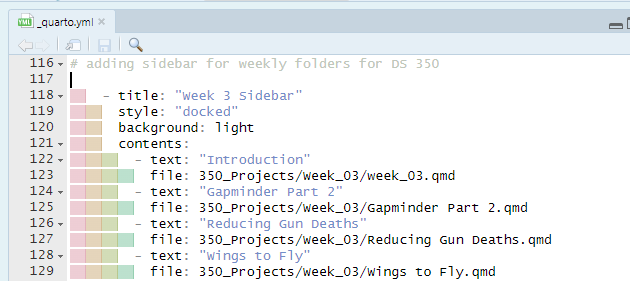

# BYUI DS Portfolio Template for course contents

# Adding QMD files for DS 350

-   add qmd file to respective week folder (only qmd file)
-   in the \_quarto.yml file add the qmd name and folder path for the week sidebar

    - Just need to add two lines of code, a "- text" and "file" lines of code to succesfully add a new qmd tot he _quarto.yml file. 
    -   In the index.qmd file, add week link if needed
-   For respective week, Add the sidebar content in the week_02.qmd file.
    -   week_02.qmd file inside the respective week folder.
    -   Add name and file path
-   Edit weekly notes if needed
-   Edit gitpush_notes file

